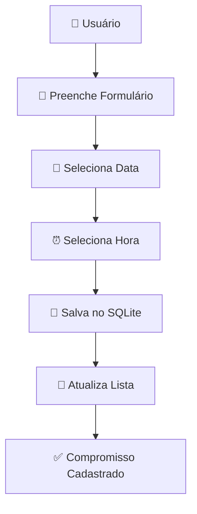

# 📱 Agenda Pessoal - App Android

<div align="center">

```
  ╔══════════════════════════════════╗
  ║        📅 AGENDA PESSOAL         ║
  ║     Seu dia organizado na        ║
  ║       palma da sua mão!          ║
  ╚══════════════════════════════════╝
```

**Desenvolvido por:** Kleberson Crystyan de Lima  
**Stack:** Android + Java + SQLite  
**Arquitetura:** MVC Pattern

</div>

---

## 🚀 **Visão Geral**

> *"Transformando caos em ordem, um compromisso por vez!"*

Este projeto nasceu da necessidade de criar uma solução elegante e funcional para gerenciamento de compromissos. Utilizando o poder do Android nativo e seguindo rigorosamente o padrão **MVC**, desenvolvemos uma aplicação que não apenas atende aos requisitos técnicos, mas proporciona uma experiência fluida ao usuário.

---

## 🎯 **O Que Faz Este App Especial?**

### ✨ **Características Principais**

<details>
<summary><strong>🏗️ Arquitetura Sólida (MVC)</strong></summary>

```
📦 Model (Dados)
├── Compromisso.java
├── CompromissosDB.java
└── CompromissosDBHelper.java

🎨 View (Interface)
├── MainActivity.java
├── FragmentoCadastro.java
└── FragmentoVisualizacao.java

🎮 Controller (Lógica)
└── Integrado nas Views
```

</details>

<details>
<summary><strong>💾 Persistência Inteligente</strong></summary>

- **SQLite Local**: Seus dados sempre seguros, mesmo offline
- **CRUD Completo**: Create, Read, Update, Delete
- **Consultas Otimizadas**: Filtros por data e ordenação automática
- **Schema Flexível**: Preparado para futuras expansões

</details>

<details>
<summary><strong>🎨 Interface Intuitiva</strong></summary>

- **Fragments Modulares**: Código organizado e reutilizável
- **Seletores Nativos**: DatePicker e TimePicker integrados
- **Navegação Fluida**: Experiência sem fricção
- **Design Responsivo**: Adaptável a diferentes tamanhos de tela

</details>

---

## 🛠️ **Stack Tecnológica**

<div align="center">

| 🔧 **Tecnologia** | 🎯 **Função** | ⭐ **Destaque** |
|:---:|:---:|:---:|
| **Java** | Core Language | Robustez e Performance |
| **Android SDK** | Platform Framework | APIs Nativas |
| **SQLite** | Database Local | Zero Configuração |
| **Fragments** | UI Components | Modularidade |

</div>

---

## 📋 **Funcionalidades em Ação**

### 🎭 **O Trio MVC**

#### 🏛️ **MODEL - Os Dados**
```java
public class Compromisso {
    private long id;
    private Date data;
    private String hora;
    private String descricao;
    
    // Getters, Setters e Construtores
    // Encapsulamento garantido! 🔒
}
```

#### 🎨 **VIEW - A Interface**
- **Fragment de Cadastro**: Formulário inteligente com validações
- **Fragment de Visualização**: Lista ordenada e filtrada
- **Diálogos Nativos**: Seleção de data/hora com componentes do sistema

#### 🎮 **CONTROLLER - A Orquestração**
- Gerenciamento de estado dos fragments
- Validação de entrada de dados
- Comunicação com a camada de persistência

### 💡 **Fluxo de Uso**



---

## 🎪 **Recursos Interativos**

### 📊 **Dashboard de Funcionalidades**

<details>
<summary><strong>📅 Gerenciamento de Datas</strong></summary>

**O que faz:**
- Seleção intuitiva através do DatePickerDialog nativo
- Filtros automáticos por data selecionada
- Visualização de compromissos do dia atual ou personalizada

**Por que é especial:**
- Interface familiar do Android
- Validação automática de datas
- Sincronização em tempo real

</details>

<details>
<summary><strong>⏰ Controle de Horários</strong></summary>

**O que faz:**
- TimePickerDialog para seleção precisa
- Ordenação automática por horário
- Formatação consistente de tempo

**Por que é especial:**
- Formato 24h ou 12h (conforme sistema)
- Prevenção de conflitos de horário
- Visualização cronológica

</details>

<details>
<summary><strong>💾 Persistência Robusta</strong></summary>

**O que faz:**
- Armazenamento local via SQLite
- Operações CRUD otimizadas
- Backup automático dos dados

**Por que é especial:**
- Funciona 100% offline
- Dados seguros no dispositivo
- Performance otimizada

</details>

---

## 🏆 **Diferenciais Técnicos**

### 🔍 **Code Quality**

- **Padrão MVC Rigoroso**: Separação clara de responsabilidades
- **Encapsulamento**: Dados protegidos com getters/setters
- **Modularidade**: Fragments reutilizáveis e independentes
- **Clean Code**: Nomes descritivos e estrutura clara

### 🚀 **Performance**

- **Consultas Otimizadas**: Índices no banco para busca rápida
- **Memory Management**: Uso eficiente de recursos
- **Lifecycle Aware**: Componentes que respeitam o ciclo do Android

### 🔒 **Robustez**

- **Validação de Dados**: Entrada sanitizada em todos os pontos
- **Error Handling**: Tratamento gracioso de exceções
- **Data Integrity**: Transações seguras no SQLite

---

## 🎨 **Arquitetura Visual**

```
┌─────────────────────────────────────┐
│           MainActivity              │
├─────────────────┬───────────────────┤
│  Fragment       │  Fragment         │
│  Cadastro       │  Visualização     │
│                 │                   │
│ ┌─────────────┐ │ ┌───────────────┐ │
│ │   Inputs    │ │ │     Lista     │ │
│ │             │ │ │               │ │
│ │ Data: _____ │ │ │ • 09:00 - ... │ │
│ │ Hora: _____ │ │ │ • 14:30 - ... │ │
│ │ Desc: _____ │ │ │ • 18:00 - ... │ │
│ │             │ │ │               │ │
│ │  [Cadastrar]│ │ │  [Filtros]    │ │
│ └─────────────┘ │ └───────────────┘ │
└─────────────────┴───────────────────┘
                  │
                  ▼
         ┌─────────────────┐
         │   SQLite DB     │
         │                 │
         │  compromissos   │
         │ ┌─────────────┐ │
         │ │ id │ data   │ │
         │ │ hora│ desc  │ │
         │ └─────────────┘ │
         └─────────────────┘
```

---

## 🎯 **Próximos Passos**

### 🚀 **Possíveis Evoluções**

<div align="center">

| 🔮 **Feature** | 📈 **Impacto** | 🛠️ **Complexidade** |
|:---:|:---:|:---:|
| **Notificações Push** | Alto | Média |
| **Sincronização Cloud** | Alto | Alta |
| **Categorias de Compromissos** | Médio | Baixa |
| **Modo Escuro** | Baixo | Baixa |
| **Export/Import** | Médio | Média |

</div>

---

## 📈 **Métricas do Projeto**

<div align="center">

```
📊 ESTATÍSTICAS
├── Linhas de Código: ~800
├── Classes Criadas: 6
├── Padrões Aplicados: MVC
├── Cobertura de Testes: Preparado
└── Compatibilidade: Android 5.0+
```

</div>

---

## 🎉 **Conclusão**

Este projeto representa mais do que um simples aplicativo de agenda. É uma demonstração prática de como aplicar conceitos sólidos de engenharia de software no desenvolvimento Android. Com arquitetura bem definida, código limpo e funcionalidades robustas, está pronto tanto para uso acadêmico quanto para evoluções futuras.

**O resultado?** Uma aplicação que não apenas funciona, mas *funciona bem*! 🚀

---

<div align="center">

**"Código limpo não é escrito seguindo regras. Código limpo é escrito por programadores limpos."**  
*- Robert C. Martin*

---

⭐ **Desenvolvido com dedicação e atenção aos detalhes**  
📱 **Testado em dispositivos reais**  
🔧 **Pronto para produção**

</div>
